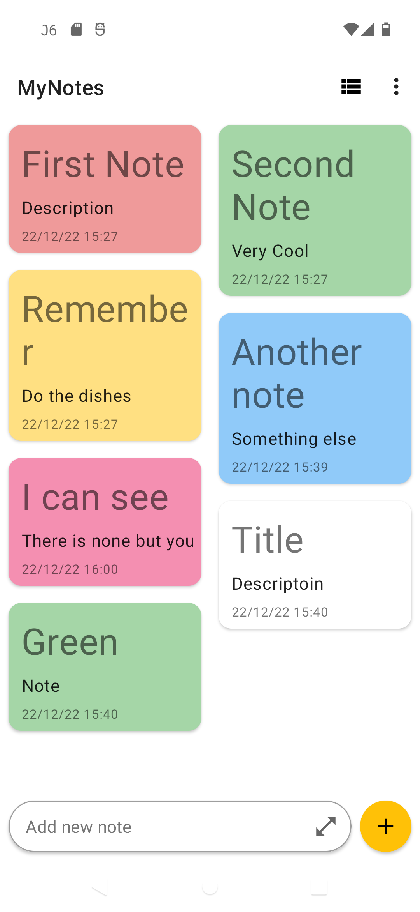
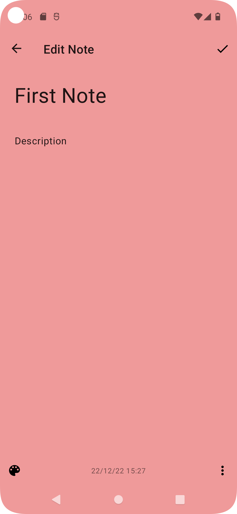
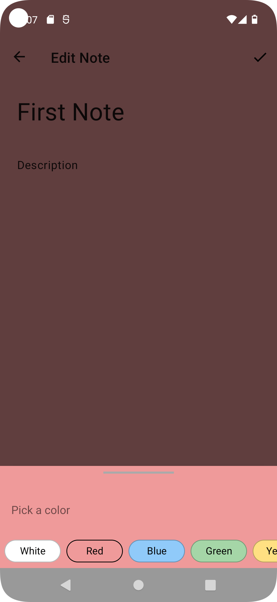
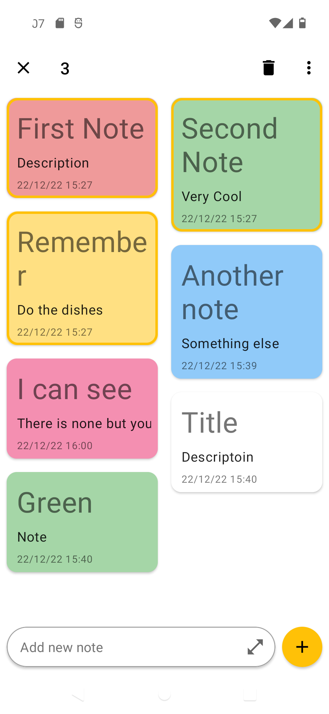

# MyNotes App (ongoing project)

   

Funcionalidades:
- Capacidade de criar uma nota rapidamente na tela de listagem de notas e/ou expandir e continuar a criação da nota na tela de NovasNotas
- Editar notas clicando no item na Listagem de Notas
- Apagar uma nota e envia-la para a lixeira
- Restaurar, todos ou individualmente, os itens da lixeira
- Apagar definitivamente, todos ou individualmente, os itens da lixeira
- As notas são salvas localmente no dispositivos usando o Room
- Segurar uma nota para selecionar uma ou mais notas e executar ações como deletar ou restaurar
